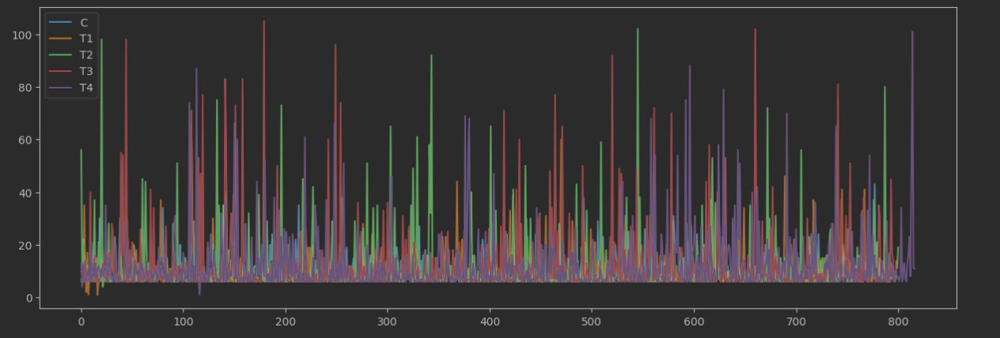

# Результаты домашней работы

## Абстрактно
Давайте сделаем так, чтобы при рекомендации учитывался и контекст пользоватля,
и контекст предыдущего трека.

## Детально
Хотим обучить *Contextual* еще и на пользователях, 
а потом анализировать рекомендации и от *Contextual* по трекам, и от *Contextual* по пользователям.
Будем брать их пересечение и рекомендовать треки из него. При этом будем запоминать рекомендованные треки.
Если мы порекомендовали все треки из пересечения, то подкидываем монетку и перенаправляем 
запрос *Contextual* по трекам или *Contextual* по пользователям

P.s. Еще можно попробовать анализировать время трека. Если мы порекомендовали все треки из пересечения,
а время трека упало после рекомендации *Contextual* по трекам, то попросим рекомендацию от *Contextual* по пользователям.
Или наоборот.

Диаграмма:

Здесь 
 * T1 - *Contextual* трекам, обученный на собранных мною данных. Находится в классе  *my_recommender.ContextualTracks*
 * T2 - *Contextual* по пользовательям. Находится в классе  *my_recommender.ContextualUsers*
 * T3 - *Contextual* и по трекам, и по пользователям, описанный в первом параграфе. Находится в классе  *my_recommender.ContextualBest*
 * T4 - *Contextual* с применением идеи анализа длины трека к T3. Находится в классе  *my_recommender.ContextualSmart*

Данные, на которых я обучал модели лежат в *collections/dataIndexedBIG.json*.

## A/B эксперимент

Видим, что наибольшее влияние внесла T3.

## Инструкция
Все как на семинаре. Весь нужный код уже написан в *server.py* и *config.json*.

Код на котором я обучал модели находится в *jupyter/hw.ipynb*. Логи не сохранились, т.к. обучал в колабе.

Полученные рекомендации в *bootify/data/tracks_recommendations.json* для треков и в *bootify/data/users_recommendations.json* для пользователей. 